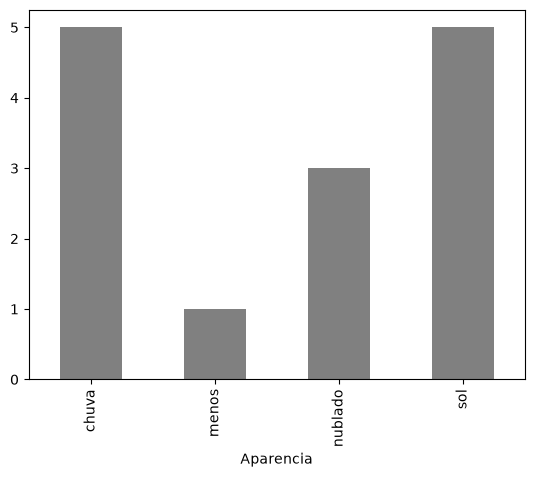
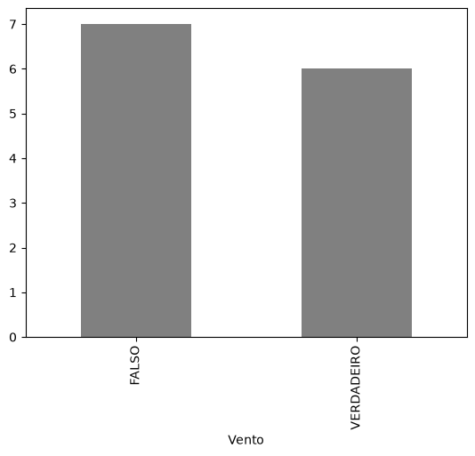
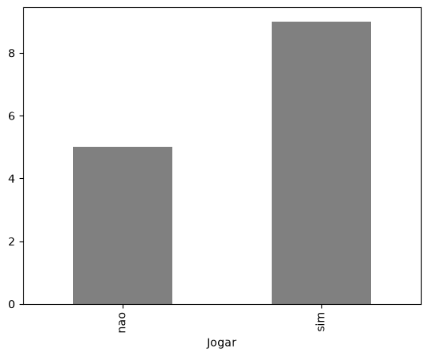
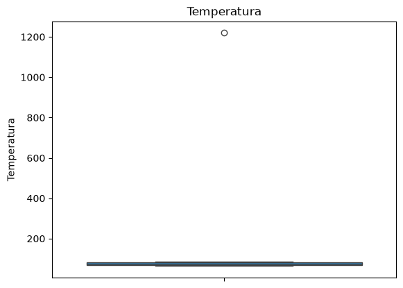
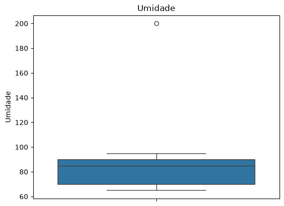
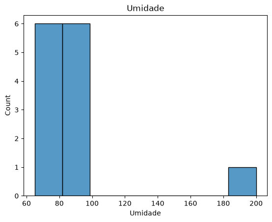

# Tempo — Limpeza e Tratamento de Dados

Projeto de **limpeza e tratamento de dados** aplicado a um conjunto de dados climáticos, desenvolvido em Python com Jupyter Notebook. O objetivo é identificar e corrigir problemas comuns em bases de dados reais — valores ausentes, valores fora do domínio esperado e outliers — deixando os dados prontos para uma análise ou modelagem posterior.

## Sobre o projeto

O dataset utilizado (`tempo.csv`) é um exemplo clássico de conjunto de dados meteorológicos usado para prever se determinadas condições climáticas favorecem ou não a realização de uma atividade ao ar livre (coluna `Jogar`). Apesar de pequeno (14 registros), ele contém propositalmente diversos problemas de qualidade de dados, o que o torna ideal para praticar técnicas de limpeza.

## Arquivos do projeto

| Arquivo | Tipo | Descrição |
|---|---|---|
| `Tempo.ipynb` | Jupyter Notebook (`.ipynb`) | Contém todo o código Python de exploração, visualização e tratamento dos dados. |
| `tempo.csv` | CSV (separador `;`) | Base de dados bruta, com os problemas de qualidade a serem tratados. |
| `README.md` | Markdown | Este documento. |

### Colunas do dataset

| Coluna | Tipo | Descrição |
|---|---|---|
| `Aparencia` | Categórica | Condição do tempo (`sol`, `chuva`, `nublado`) |
| `Temperatura` | Numérica | Temperatura registrada (em graus) |
| `Umidade` | Numérica | Percentual de umidade do ar (0 a 100) |
| `Vento` | Categórica (binária) | Se estava ventando (`VERDADEIRO` / `FALSO`) |
| `Jogar` | Categórica (binária) | Se a atividade foi realizada (`sim` / `nao`) |

## Ferramentas utilizadas

- **Python 3**
- **pandas** — manipulação e limpeza dos dados
- **seaborn** / **matplotlib** — visualização gráfica
- **statistics** — cálculo de mediana, moda e desvio padrão

## Passo a passo do que foi feito

### 1. Importação e exploração inicial

Os dados foram carregados com `pandas.read_csv` e explorados com `.head()` e `.shape` para entender o formato geral (14 linhas, 5 colunas).

### 2. Exploração dos dados categóricos

Cada coluna categórica foi agrupada com `groupby().size()` para visualizar a distribuição de valores, e representada em gráficos de barras.

**Aparência**

**Vento**

**Jogar**

### 3. Exploração dos dados numéricos

As colunas `Temperatura` e `Umidade` foram analisadas com `.describe()` e visualizadas em boxplot/histograma, o que já deixou visíveis indícios de outliers (valores de desvio padrão e máximo muito acima do esperado).

**Boxplot de Temperatura (antes do tratamento)**

**Boxplot de Umidade (antes do tratamento)**

**Histograma de Umidade**

### 4. Diagnóstico dos problemas

Com `dadosTempo.isnull().sum()`, foi identificado:

- 1 valor ausente (`NA`) em `Umidade`
- 1 valor ausente (`NA`) em `Vento`

Além disso, a exploração categórica/numérica revelou:

- Um valor de `Umidade` fora do domínio válido (200%, quando o máximo possível é 100%)
- Categorias inválidas em `Aparencia` (`"menos"` e `"FALSO"`, que não fazem parte do domínio esperado)
- Um outlier extremo em `Temperatura` (1220°, muito acima dos demais valores)

A partir disso, foi montado um checklist de tratamento no próprio notebook para guiar o trabalho.

### 5. Tratamento da coluna `Umidade`

- O valor ausente foi substituído pela **mediana** da coluna (85.5).
- O valor fora de domínio (200%) também foi substituído pela mediana.
- Após o tratamento, a checagem de nulos e de valores fora do intervalo [0, 100] confirmou que não restava nenhuma inconsistência.

### 6. Tratamento da coluna `Vento`

- O valor ausente foi substituído pela **moda** da coluna (`FALSO`, valor mais frequente).

### 7. Tratamento da coluna `Aparencia`

- As categorias inválidas (`"menos"` e `"FALSO"`) foram substituídas pela **moda**.
- Como a distribuição era bimodal (`chuva` e `sol` empatados como os valores mais frequentes), o critério de desempate adotado foi a **ordem alfabética**, resultando na escolha de `chuva`.

### 8. Tratamento de outlier em `Temperatura`

- Foi calculado o **desvio padrão** da coluna.
- Os registros com `Temperatura >= 2 × desvio padrão` foram identificados como outlier (o valor 1220°).
- Esse valor foi substituído pela **mediana** da coluna, arredondada para número inteiro (74°) para manter o mesmo tipo de dado (inteiro) da coluna original.

**Resultado final da coluna Temperatura (depois do tratamento):**

| Métrica | Antes | Depois |
|---|---|---|
| Média | 155.57 | 73.71 |
| Desvio padrão | 306.43 | 6.56 |
| Mínimo | 64 | 64 |
| Máximo | 1220 | 85 |

O desvio padrão caiu de **306.43 para 6.56** e o valor máximo saiu de **1220 para 85**, confirmando que o outlier foi corrigido e a distribuição da coluna passou a refletir valores plausíveis de temperatura.

## Resultado

Ao final do processo, o dataset `dadosTempo` está livre de valores ausentes, valores fora de domínio e outliers extremos, estando pronto para etapas seguintes de análise exploratória ou construção de modelos.
